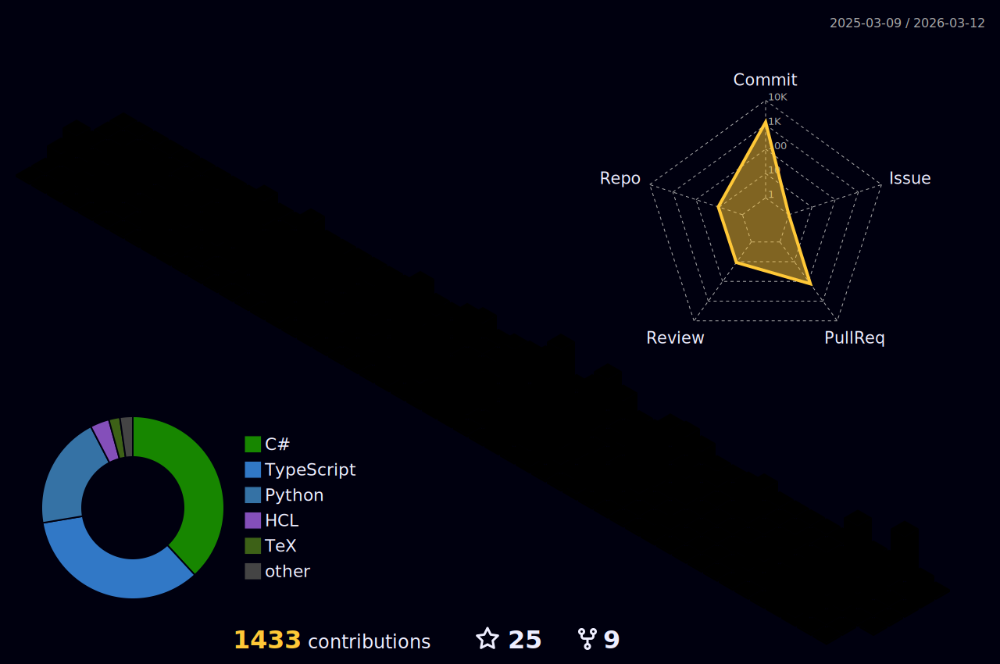

### Hi there 👋
## I am Nawodya Ishan </h2>

#### An undergraduate student from 🇱🇰 Sri Lanka Technological Campus AKA SLTC📡 involving in ML, Game and Web Dev.

- 🔭 I’m currently working on Python ML, Unity C#, Swift & Django..
- 🎓 IEEE CS SBC Chairman @SLTC
- 🎯 Highly motivated to learn and explore new tech and solve problems ✅
- ⚡ Fun fact: I love playing my drums for 🎸rock & metal music while Headbanging \m/

- 👨‍💻 Visit [http://nawodyaishan.github.io](http://nawodyaishan.github.io)

- 📫 How to reach me **nawodyain@gmail.com**

  

<!-- 
  

-->

  

<h3 align="center">Connect with me</h3>

 

 

<h3 align="center">Experience</h3>

<!--

                                                         

 --> 

 
 

 

 

 

 

 

 

<!--

-->

&nbsp;

 

## Blog posts

<!-- BLOG-POST-LIST:START -->
- [Introduction to Machine Learning and Hello World in Neural Networks](https://dev.to/nawodyaishan/introduction-to-machine-learning-and-hello-world-in-neural-networks-51e1)
- [Introduction to Machine Learning and Hello World in Neural Networks](https://nawodyaishan.medium.com/introduction-to-machine-learning-and-hello-world-in-neural-networks-317ab0f9fdfa?source=rss-6c6cc46357d5------2)
<!-- BLOG-POST-LIST:END -->

<!-- svg source =  https://worldvectorlogo.com -->
