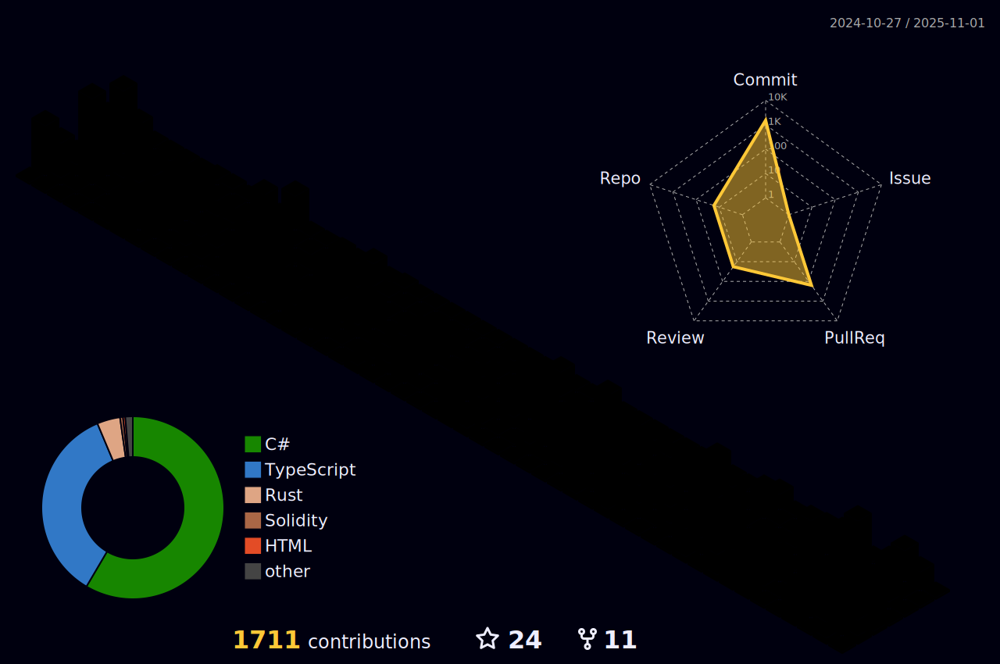

### Hi there 👋

## I am Nawodya Ishan </h2>

#### An undergraduate student from 🇱🇰 Sri Lanka Technological Campus AKA SLTC 📡 

- 🔭 I’m currently focusing on Unity and C#.....
- 🎓 IEEE CS SBC Chairman @SLTC
- 🎯 Highly motivated to learn and explore new tech and solve problems ✅
- ⚡ Fun fact: I love playing drums for 🎸rock & metal music while Headbanging \m/

- 👨‍💻 Visit [http://nawodyaishan.github.io](http://nawodyaishan.github.io)

- 📫 How to reach me **nawodyain@gmail.com**

<!--

  

 
  

  

-->

<h3 align="center">Connect with me</h3>

 

 

#

<h3 align="center">Experience</h3>

 

 

 

 

  
 

  
#

## Blog posts

<!-- BLOG-POST-LIST:START -->
- [Begin your C# Game Development Journey Using This Challenge](https://dev.to/nawodyaishan/begin-your-c-game-development-journey-using-this-challenge-1d59)
- [Introduction to Machine Learning and Hello World in Neural Networks](https://dev.to/nawodyaishan/introduction-to-machine-learning-and-hello-world-in-neural-networks-51e1)
<!-- BLOG-POST-LIST:END -->

#

<!--

-->

&nbsp;

<!-- svg source =  https://worldvectorlogo.com -->
